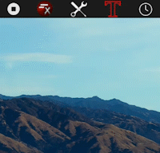
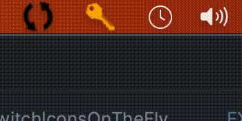

# FXTrayIcon

[](https://search.maven.org/search?q=g:%22com.dustinredmond.fxtrayicon%22%20AND%20a:%22FXTrayIcon%22)

Library for use in JavaFX applications that makes adding a System Tray icon easier.
The FXTrayIcon class handles all the messy AWT and Swing parts of constructing an icon,
displaying notifications, creating a context menu, etc. This means that users of FXTrayIcon can
work solely with its public API and JavaFX classes that they are already familiar with.

Check out the [runnable test application](./src/test/java/com/dustinredmond/fxtrayicon/RunnableTest.java) in the test directory for an example of how this works.

## Usage

From within your JavaFX application, adding a tray icon is as simple as two lines of code.
Yes, really, that's it!

```java
// Pass in the app's main stage, and path to the icon image
FXTrayIcon icon = new FXTrayIcon(stage, getClass().getResource("someImageFile.png"));
icon.show();
```

## Or use Builder Style

```java
FXTrayIcon icon = new FXTrayIcon.Builder(stage, iconURL).menuItem("Menu 1", e-> myMethod()).addExitItem().show().build();
```

[Click here for a Builder tutorial](https://github.com/dustinkredmond/FXTrayIcon/blob/main/BuilderTutorial.md)

## How do I add to my project

The project is available as a Maven dependency on Central. Add the following to POM.xml

```xml
<dependency>
  <groupId>com.dustinredmond.fxtrayicon</groupId>
  <artifactId>FXTrayIcon</artifactId>
  <version><!--See Below --></version>
</dependency>
```

Or, if using Gradle to build, add the below to your Gradle build file

```groovy
compile group: 'com.dustinredmond.fxtrayicon', name: 'FXTrayIcon', version: '<see below>'
```

You can even use it from a Groovy script!

```groovy
@Grapes(
  @Grab(group='com.dustinredmond.fxtrayicon', module='FXTrayIcon', version='<see below>')
)
```

*Note, for the current stable version number, use the following:*
[](https://search.maven.org/search?q=g:%22com.dustinredmond.fxtrayicon%22%20AND%20a:%22FXTrayIcon%22)

## Features & Screenshots

### CheckMenuItems

FXTrayIcon now supports the use of CheckMenuItems - See Javadocs for specifics.



## Animated Icons

FXTrayIcon now offers a convenient way to animate the icon in the tray. This is great 
for things like letting the user know when the program is processing something or even 
to subtly get their attention.



The way you use it is straightforward. First, create all the frames of the animation and 
save each frame into a file. The turning circle above, for example, took 45 files to create. 
Once you have the files, 
you can load them into FXTrayIcon in one of two ways: Pass in `LinkedList<java.io.File>` or 
`LinkedList<javafx.scene.image.Image>`. 

For example, create a `LinkedList<File>` containing the `File` objects of each frame, 
and then pass them into FXTrayIcon using the Builder or after FXTrayIcon has been instantiated. 
We recommend putting the files into their own folder; numbered in sequence, then create the 
list from that folder.

Creating the list:

```Java
File[]  files = new File("path/to/my/imageFiles").listFiles();
LinkedList<File> fileList = new LinkedList<>(Arrays.asList(files));
fileList.sort(Comparator.comparing(File::getName));
```

Using the list with the Builder:
```Java
trayIcon = new FXTrayIcon.Builder(primaryStage, iconFile)
    .animate(fileList, 75)
    .addExitMenuItem("Exit", e -> Main.stopRunning())
    .show()
    .build();  
```

Or after instantiation:
```Java
trayIcon.newAnimation(fileList, 75);
```

The `.newAnimation()` method can also be used to replace an existing animation.

The number after `fileList` is the amount of time that each frame will be shown, specified in milliseconds. 

These methods can be used to play and control the animation:

```Java
trayIcon.play();
trayIcon.playFromStart();
trayIcon.stop();
trayIcon.pause();
trayIcon.pauseResume();
trayIcon.stopReset();
trayIcon.resetIcon();
```

Use these methods to get the state of the animation:
```Java
trayIcon.isRunning();
trayIcon.isPaused();
trayIcon.isStopped();
```

And if you need access to the timeline of the animation for any reason, just use `trayIcon.getTimeline()`

There is a full working program in the test folder called Animation. It will show you everything you need 
to know. The JavaDocs are also available and are very thorough.


### FXTrayIcon on Windows 10's tray


Above is an example of FXTrayIcon running on Windows 10, of course, you choose your own icon file.
Here we used a link icon from [Icons8](https://www.icons8.com), they provide thousands of amazing
icons for developers, both free (with an attribution) and paid.

### Context Menu - uses JavaFX MenuItem


An example of FXTrayIcon's custom context menu, built using JavaFX MenuItems.
Surprise, surprise, JavaFX MenuItems get translated into AWT MenuItems by FXTrayIcon,
so there's no need to use those! A developer can work solely with JavaFX Menus and MenuItems.

### Tray notifications

The following can be used to show notifications. Note that the `showMessage()` method
uses the icon from FXTrayIcon in the notification, while the others use different icons
to indicate the level of severity of the message.

- `showMessage(String caption, String content)`
    - or `showMessage(String content)`

      

- `showInfoMessage(String caption, String content)`
    - or `showInfoMessage(String content)`

      

- `showWarnMessage(String caption, String content)`
    - or `showWarnMessage(String content)`

      

- `showErrorMessage(String caption, String content)`
    - or `showErrorMessage(String content)`

      

## Supported operating systems

| OS         | Support Status      | Unsupported Features                                                                                                                                                                                                                   |
|------------|---------------------|----------------------------------------------------------------------------------------------------------------------------------------------------------------------------------------------------------------------------------------|
| Windows 11 | Fully supported     | N/A                                                                                                                                                                                                                                    |
| Mac OS     | Partially supported | In the `displayMessage()` methods. Custom notification icons are not supported in AppleScript calls, but the TrayIcon is.                                                                                                              |
| Linux      | Partially supported | Some desktop environments that support `java.awt.SystemTray` are supported. Many are **not**. You should not rely on the `isSupported` method as a matter of truth, testing on individual desktop environments is strongly encouraged. |

Call `FXTrayIcon.isSupported()` to see if the current platform
supports the system tray.

### Access to TrayIcon

Being a JavaFX library, much care has gone into keeping the AWT portions of the library out of sight within your IDE while using FXTrayIcon. However, we realize that there are situations where it would be useful to have access to the
underlying TrayIcon awt object, so this can be done in two different ways.

-   You can extend FXTrayIcon and in that extended class, you can access the `getTrayIcon()` protected method.
-   Once you have FXTrayIcon instantiated, you can call the `getRestricted()` method then gain access to the TrayIcon object through that method.

### About icon sizes
The nature of how FXTrayIcon needing to be a library that works side by side with Swing, because we still do not 
have a native JavaFX means for utilizing the system tray, icon sizing can be problematic with different operating systems.
If you use the methods that do not require you to specify the icon size, then FXTrayIcon will use the best
size for whichever operating system you're running it on. Windows requires a slightly smaller size than Macs.

This animation feature does not have any options for specifying the size of the icon because it is best to just
let it use the defaults. However, if you still want to control the size of the icon and the animation icon,
then you can override the defauoy by using:

```Java
.setIconSize(width, height);
.setIconSize(oneValueWH);
```

Then those values will become the default icon size that the Builder uses anywhere an icon size isn't required, 
and also the animation feature will use those values.

You can use that method in the build statement or after instantiation. The Builder will not build anything until
the end so that you have an opportunity to change those values if desired.

## Icon Size Changes
FXTrayIcon will automatically set the optimal size of your icon based on the operating system you are running in.
However, if you wish to set the icon size yourself, you can use the instance or Builder `setIconSize()` method. For
optimal performance, especially when using animated icons, best practice is to provide icon images that are already
in the optimal dimension for your operating system:
- Linux: 22 x 22
- MacOS: 22 x 22
- Windows: 16x16

You only need to use the `setIconSize()` method one time for each instance of FXTrayIcon, and any time you change 
the image after that it will be sized accordingly.

## Projects using `FXTrayIcon`

- [Cisco C2C Reporting](https://www.cisco.com/c/dam/en_us/about/doing_business/open_source/docs/C2CReportingApp-100-1730341249.pdf) - Cisco DoD Comply-to-Connect reporting application
- [GistFX](https://github.com/RedmondSims/GistFX) - A utility that makes managing and organizing your GitHub Gists easy and convenient.
- [GlucoStatusFX](https://github.com/HanSolo/glucostatusfx) - Glucose status monitor for Nightscout implemented in JavaFX.
- [JDKMon](https://github.com/HanSolo/JDKMon) - A tool that monitors your installed JDK's and informs you about updates.
- [JFXCentral](https://www.jfx-central.com/) - Home to everything JavaFX related. Website is written in JavaFX with [JPro](https://www.jpro.one/) -  Desktop Version uses FXTrayIcon.
- [NFC4PC](https://github.com/martinpaljak/NFC4PC) - Makes your desktop PC react to NFC tags by opening them just like a mobile phone.

If your project uses FXTrayIcon, let us know via Pull Request, and we'll feature your project on this README.
