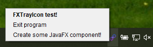

# FXTrayIcon

[](https://search.maven.org/search?q=g:%22com.dustinredmond.fxtrayicon%22%20AND%20a:%22FXTrayIcon%22)
[](https://travis-ci.com/dustinkredmond/FXTrayIcon)

Library for use in JavaFX applications that makes adding a System Tray icon easier.
The FXTrayIcon class handles all the messy AWT and Swing parts of constructing an icon, 
displaying notifications, creating a context menu, etc. This means that users of FXTrayIcon can
work solely with its public API and JavaFX classes that they are already familiar with.

Check out the [runnable test application](./src/test/java/com/dustinredmond/fxtrayicon/RunnableTest.java) in the test directory for an example of how this works. 


## Usage

From within your JavaFX application, adding a tray icon is as simple as two lines of code.
Yes, really, that's it!

```java
// Pass in the app's main stage, and path to the icon image
FXTrayIcon icon = new FXTrayIcon(stage, getClass().getResource("someImageFile.png"));
icon.show();
```

## Or use Builder Style
```java
FXTrayIcon icon = new FXTrayIcon.Builder(stage, iconURL).menuItem("Menu 1", e-> myMethod()).addExitItem().show().build();
```
[Click here for a Builder tutorial](https://github.com/dustinkredmond/FXTrayIcon/blob/main/BuilderTutorial.md)

## How do I add to my project 

The project is available as a Maven dependency on Central. Add the following to POM.xml

```xml
<dependency>
  <groupId>com.dustinredmond.fxtrayicon</groupId>
  <artifactId>FXTrayIcon</artifactId>
  <version><!--See Below --></version>
</dependency>
```

Or, if using Gradle to build, add the below to your Gradle build file

```groovy
compile group: 'com.dustinredmond.fxtrayicon', name: 'FXTrayIcon', version: '<see below>'
```

You can even use it from a Groovy script!

```groovy
@Grapes(
  @Grab(group='com.dustinredmond.fxtrayicon', module='FXTrayIcon', version='<see below>')
)
```

*Note, for the current stable version number, use the following:*
[](https://search.maven.org/search?q=g:%22com.dustinredmond.fxtrayicon%22%20AND%20a:%22FXTrayIcon%22)


## Features & Screenshots


### FXTrayIcon on Windows 10's tray


Above is an example of FXTrayIcon running on Windows 10, of course, you choose your own icon file.
Here we used a link icon from [Icons8](https://www.icons8.com), they provide thousands of amazing
 icons for developers, both free (with an attribution) and paid.


### Context Menu - uses JavaFX MenuItem



An example of FXTrayIcon's custom context menu, built using JavaFX MenuItems.
Surprise, surprise, JavaFX MenuItems get translated into AWT MenuItems by FXTrayIcon,
so there's no need to use those! A developer can work solely with JavaFX Menus and MenuItems.


### Tray notifications

The following can be used to show notifications. Note that the `showMessage()` method
uses the icon from FXTrayIcon in the notification, while the others use different icons
to indicate the level of severity of the message.

  - `showMessage(String caption, String content)`
    - or `showMessage(String content)`
      
      

  - `showInfoMessage(String caption, String content)`
    - or `showInfoMessage(String content)`
      
      

  - `showWarnMessage(String caption, String content)`
    - or `showWarnMessage(String content)`
      
      

  - `showErrorMessage(String caption, String content)`
    - or `showErrorMessage(String content)`
      
      


## Supported operating systems

| OS         | Support Status      | Unsupported Features                                                                                                      |
|------------|---------------------|---------------------------------------------------------------------------------------------------------------------------|
| Windows 10 | Fully supported     | N/A                                                                                                                       |
| Mac OS     | Partially supported | In the `displayMessage()` methods. Custom notification icons are not supported in AppleScript calls, but the TrayIcon is.  |
| Linux      | Partially supported | Some desktop environments that support `java.awt.SystemTray` are supported. Many are **not**. You should not rely on the `isSupported` method as a matter of truth, testing on individual desktop environments is strongly encouraged.                            |


Call `FXTrayIcon.isSupported()` to see if the current platform
supports the system tray.


## Projects using `FXTrayIcon`
- [JDKMon](https://github.com/HanSolo/JDKMon) - A tool that monitors your installed JDK's and informs you about updates.
- [GlucoStatusFX](https://github.com/HanSolo/glucostatusfx) - Glucose status monitor for Nightscout implemented in JavaFX.
- [GistFX](https://github.com/RedmondSims/GistFX) - A utility that makes managing and organizing your GitHub Gists easy and convenient.

If your project uses FXTrayIcon, let us know via Pull Request, and we'll feature your project on this README.
